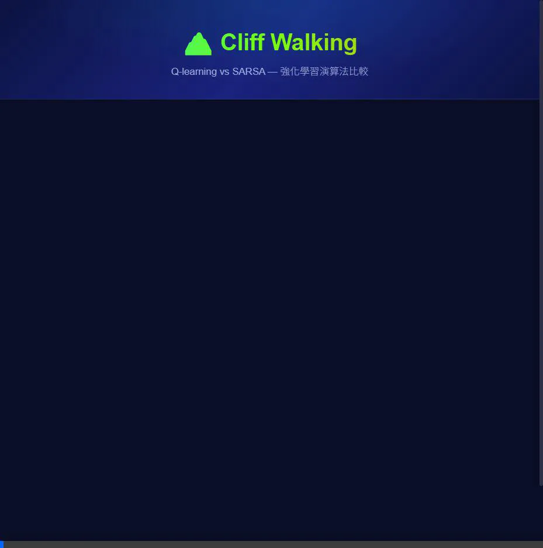

# 0415DRL_HW2 - Cliff Walking: Q-learning vs SARSA

**[Live Demo](https://enwu03.github.io/0415DRL_HW2/)**



This project implements and compares two classic reinforcement learning algorithms — **Q-learning** (Off-policy) and **SARSA** (On-policy) — on the **Cliff Walking** gridworld environment. Both algorithms are trained under identical parameters for fair comparison.

## Environment Description

- **Grid**: Configurable rectangular grid (default 4 × 12)
- **Start (S)**: Bottom-left corner
- **Goal (G)**: Bottom-right corner
- **Cliff (☠)**: Bottom row between Start and Goal
- **Rewards**: Step = −1, Cliff = −100 (reset to Start), Goal = episode ends

## Algorithm Implementation

### Q-learning (Off-policy)
```
Q(s, a) ← Q(s, a) + α [r + γ · max_a' Q(s', a') − Q(s, a)]
```
Uses `max Q(s', a')` to update — learns the **optimal policy** regardless of exploration behavior.

### SARSA (On-policy)
```
Q(s, a) ← Q(s, a) + α [r + γ · Q(s', a') − Q(s, a)]
```
Uses the **actual next action** `Q(s', a')` to update — learns a policy that accounts for exploration risk.

## Parameters (User-Tunable)

| Parameter | Default | Range |
|---|---|---|
| Learning Rate (α) | 0.1 | 0.01 - 1.0 |
| Discount Factor (γ) | 0.9 | 0 - 1.0 |
| Exploration Rate (ε) | 0.1 | 0 - 0.5 |
| Episodes | 500 | 100 - 5000 |
| Grid Rows | 4 | 3 - 10 |
| Grid Columns | 12 | 4 - 20 |

## Results Analysis

The app auto-generates a comprehensive analysis with three sections:

### 一、學習表現 (Learning Performance)
- Cumulative reward curve per episode (smoothed)
- Convergence speed comparison (50-episode moving average)

### 二、策略行為 (Policy Behavior)
- Learned path visualization with directional arrows
- Q-learning → **Risky** shortest path along cliff edge
- SARSA → **Safe** longer path away from cliff

### 三、穩定性分析 (Stability Analysis)
- Reward standard deviation (volatility)
- Cliff fall count during training
- Exploration (ε) impact on each algorithm with probability calculations

---

## Setup and Execution

This is a **pure frontend** application (HTML/CSS/JS). No backend server is required.

### Option 1: GitHub Pages
Simply visit the **[Live Demo](https://enwu03.github.io/0415DRL_HW2/)**.

### Option 2: Run Locally

1. Clone the repository:
   ```bash
   git clone https://github.com/enwu03/0415DRL_HW2.git
   cd 0415DRL_HW2
   ```

2. Open `index.html` in any modern browser, or serve via a local HTTP server:
   ```bash
   python -m http.server 8080
   ```
   Then navigate to **[http://localhost:8080](http://localhost:8080)**.

3. Adjust parameters, click **「開始訓練」** to train, and review the results!

## Tech Stack
- **HTML5** — Semantic structure
- **CSS3** — Dark glassmorphism theme with responsive layout
- **JavaScript (ES6+)** — RL algorithms, Canvas chart rendering, DOM visualization
